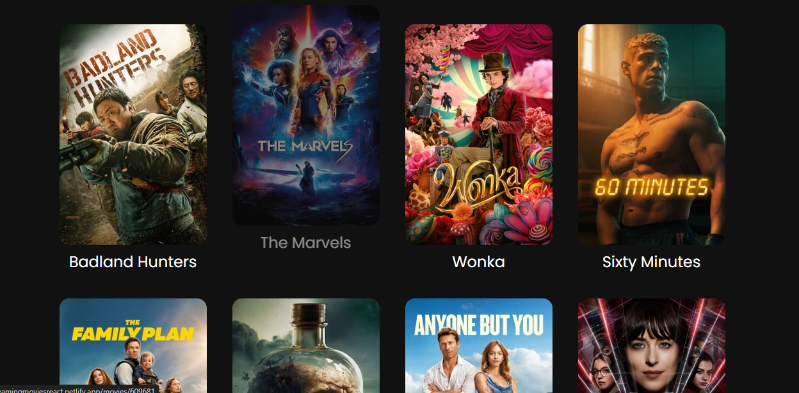
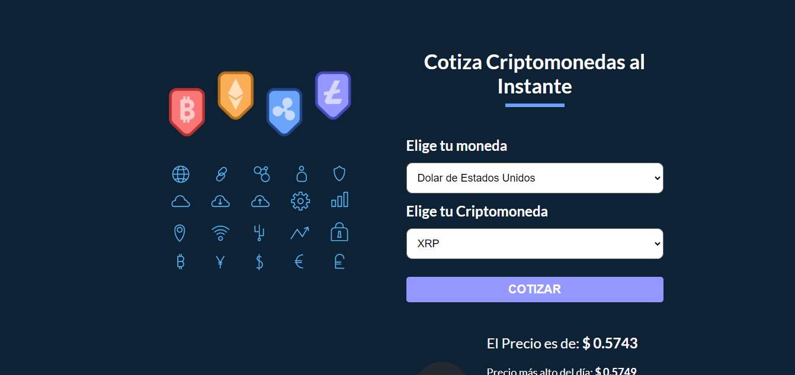
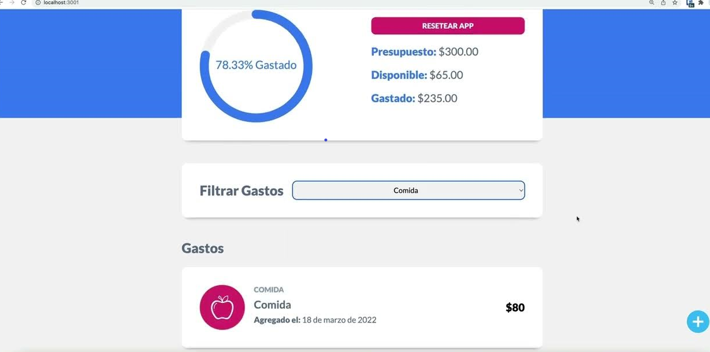

    <h1 align="center">Hello, I am <a href="https://moisesahportofolio.netlify.app/">Moises Alarcon</a></h1>
    

          

    
## About me
    
 - 🌍 From Santo Domingo,Republica Dominicana.
 - 💼 I work as a Project and Automation Engineer
 - 🎓 I studied Mechatronics🤖🦾 and I am currently working as a Web programmer.

      
    
     
     
     ## React + API's

    <table>
    <tr>
    <td width="50%">
    <h3 align="center">🎬 Movies</h3>
     

    
    

    
    <a href="https://streamingmoviesreact.netlify.app/" target="_blank">
    
    

    
One of my favorites Projects 

    

   
                                                                                          
    </td> 
  
    
    <td width="50%">
      
    <h3 align="center">Cryptocurrencies</h3>
    
                                       
    
     

    

    <a href="https://excryptocurrenciesreact.netlify.app/" target="_blank">
    <a/>
     
    

    
This was a similar form with react and tailwind

    
                                                             
    </table>                                                                                 
    

     
    ## JavaScript + React⚛️

    <table>
    <tr>
    <td width="50%">
    <h3 align="center">Validation Email</h3>
     

    
    

    
    <a href="https://effulgent-taiyaki-045932.netlify.app/" target="_blank">
    
    

    
This project was done with <strong>Tailwind and JavaScript</strong>I hope you like it! 

    

   
                                                                                          
    </td> 
  
    
    <td width="50%">
      
    <h3 align="center">🐕Citas-React</h3>
    
                                       
    
     

    

    <a href="https://citasreactvet.netlify.app/" target="_blank">
    <a/>
     
    

    
This was a similar form with react and tailwind

    
                                                             
    </table>                                                                                 
    

     

    <table>
    <tr>
    <td width="50%">
    <h3 align="center">Weekly Expense</h3>
     

    
    

    
    <a href="https://fantastic-platypus-1522d0.netlify.app/" target="_blank">
    
    

    
This project was done with <strong>Boostrap and JavaScript</strong>I hope you like it! 

    

   
                                                                                          
    </td> 
  
    
    <td width="50%">
      
    <h3 align="center">Control de Gastos</h3>
    
                                       
    
     

    

    <a href="https://github.com/abrahanalarcon/control-gastos" target="_blank">
    <a/>
     
    

    
This was a similar form with react and tailwind

    
                                                             
    </table>                                                                                 
    

     

    ## JavaScript 
    
    <table>
    <tr>
    <td width="50%">
    <h3 align="center">Suits</h3>
    

    
    

    
    

    

    
This is one of my favorite projects <strong>with HTML, CSS PLAIN and JavaScript</strong> 

    

    

                                                                                          
    </td>
          
    
    <td width="50%">
    <h3 align="center">Online Courses</h3>
     

    
    

    
      <a href="https://beamish-selkie-30615b.netlify.app/#" target="_blank">
    

    

    
This project was done with <strong>JavaScript</strong> apply the function of <strong> Local Storage</strong>I hope you like it! 

    

  
                                                                                          
    </td>  
    </table>                                                                                 
    

     

     ## Vanilla 
    
    <table>
    <tr>
    <td width="50%">
    <h3 align="center">Coffee Blog</h3>
    

    
    

    
    

    

    
This is one of my favorite project in <strong> Vanilla </strong>

    

    

                                                                                          
    </td>
          
    
    <td width="50%">
    <h3 align="center">Freelancer Page</h3>
     

    
    

    
    <a href="https://taupe-valkyrie-fb7011.netlify.app/" target="_blank">
    

    

   
    

  
                                                                                          
    </td>  
    </table>                                                                                 
    

     
    
    
    
       

     

  

     
    
  
     👁️ You can see more projects at:
    <a href="https://codepen.io/abrahanalarcon" target="_blank">CODEPEN</a>
    

    
       
    

   ## C#
     <table>
    <tr>
    <td width="50%">
    <h3 align="center">Bank Account</h3>
    

    
   

    
    

    
    
This project was done a long time ago to acquire basic knowledge about the concepts that
      It is a class, which is an object, a method and an inheritance.

    

    

                                                                                          
    </td>

     ## Projects with C  in Mechatronics
    
    
    <table>
    <tr>
    <td width="50%">
    <h3 align="center">Game Boy</h3>
    

    
    

    
    
    

    
    
This is one of my favorite projects, <strong>it is a kind of Atari game with two modules,</strong> I used a joystick, a speaker, and an LED matrix. This project was with <a href="https://www.st.com/en/development-tools/stm32cubeide.html" target="_blank">the stm32cubeide IDE</a>

    

    

                                                                                          
    </td>
    
    <td width="50%">
      
    <h3 align="center">Avoiding Obstacle Robot </h3>
    
                                       
    
     
       

    
    

    
    
This is one of my favorite projects, <strong>it is a kind of Atari game with two modules,</strong> I used a joystick, a speaker, and an LED matrix. This project was with <a href="https://www.st.com/en/development-tools/stm32cubeide.html" target="_blank">the stm32cubeide IDE</a>

    
                                                             
    </table>                                                                                 
    

     
    
     
 <body>   
  
   

 

## <b> Skills</b>
 
    
- **Front-End Development**:

   
   
   
   
   

 

- **Back-End Development**:

    
    
    
    

 

- **Softwares and Tools**:

    
    
    
    
    

    

   

  </body>    
