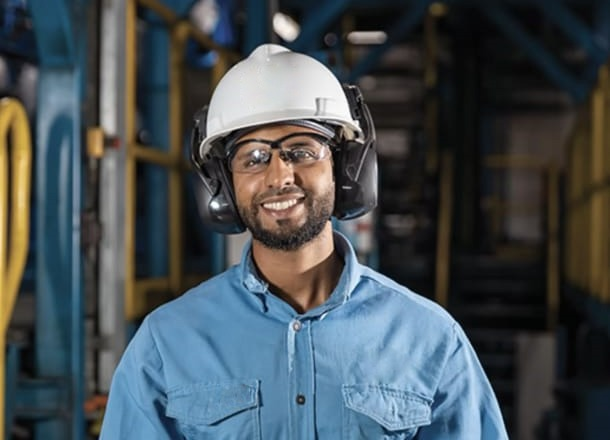

# 👋 Moises Alarcon

### IT/OT Engineer | Industrial Automation | SCADA & Industrial Networks

 

---

## 👨‍💻 About Me

I am an **IT/OT Engineer with a background in Mechatronics Engineering**, focused on **industrial automation, SCADA systems, industrial networking, and the integration of IT and operational technology**.

My experience combines industrial environments with software and networking technologies, allowing me to work across the different layers that connect **industrial processes, control systems, networks, databases, and business applications**.

### 🎯 Professional Focus

* 🏭 **Industrial Automation & Control Systems**
* 📊 **SCADA & HMI Systems**
* 🌐 **Industrial Networking & Ethernet**
* 🔒 **OT Cybersecurity & Network Segmentation**
* 🔌 **Industrial Protocols & Communication**
* 💻 **IT/OT Integration**
* 🗄️ **SQL Server & Industrial Data**
* 📈 **Data Visualization & Power BI**
* ⚙️ **Software Development for Industrial Environments**

> My goal is to design and implement **reliable, secure, and scalable industrial systems that connect operational technology with modern IT infrastructure.**

---

# ⚙️ Core Expertise

| 🏭 Industrial Automation | 🌐 Industrial Networking |   💻 IT & Software   |
| :----------------------: | :----------------------: | :------------------: |
|           SCADA          |           Cisco          |       C# / .NET      |
|            ICS           |           VLANs          |      SQL Server      |
|            HMI           |    Industrial Ethernet   |       REST APIs      |
|     PLC Communication    |   Network Segmentation   |         React        |
|   Industrial Protocols   |    Redundant Networks    |       Power BI       |
|      Control Systems     |        OT Networks       | Database Integration |

---

# 🏭 SCADA & Industrial Automation

### Systems & Technologies

### Areas of Experience

* SCADA architectures
* Industrial Control Systems (ICS)
* HMI development and integration
* PLC communication
* Industrial instrumentation
* Industrial protocols
* Process monitoring
* Control system integration
* OT/IT integration

---

# 🌐 Industrial Networking

My networking focus is centered on **industrial and OT environments**, where reliability, segmentation, availability, and security are critical.

### Technologies

### Areas of Experience

* Industrial Ethernet
* VLAN segmentation
* SCADA network architecture
* Network redundancy
* Industrial network design
* IT/OT network integration
* Network security
* OT cybersecurity
* Cisco networking
* MikroTik networking
* Fortinet security

---

# 🚀 Featured Industrial Projects

## 🔌 SCADA Network Architecture

Design of a **secure and redundant SCADA network architecture** integrating IT and OT environments through network segmentation and industrial communication technologies.

### Technologies

* Cisco Packet Tracer
* VLAN Segmentation
* Industrial Ethernet
* Redundant Network Topology
* SCADA Architecture
* Industrial Protocols

### Architecture

* Control Center Network
* Industrial Plant Network
* Segmented OT Network
* Redundant Communication
* Secure Industrial Infrastructure

---

## 📊 Industrial Monitoring Dashboard

A real-time monitoring interface inspired by industrial SCADA systems, focused on **process visualization and data integration**.

### Technologies

* React
* REST API
* Data Visualization
* Industrial Monitoring Concepts

---

# 💻 Software Development

My software development background supports my work in **IT/OT integration and industrial systems**.

### Backend

### Frontend

### Other Technologies

* REST APIs
* SQL Server
* Database Integration
* Data Visualization
* Enterprise Applications

---

# ⚛️ Software Projects

Although my current professional focus is **IT/OT and Industrial Automation**, my software development background allows me to build applications and APIs that complement industrial systems.

## 🎬 Movies — React

A React application focused on movie discovery and streaming-style interfaces.

---

## 💰 Cryptocurrencies — React

A cryptocurrency visualization application built with React and the CryptoCompare API.

### Technologies

* React
* Styled Components
* Custom Hooks
* REST API
* CryptoCompare API

---

# ⚙️ Mechatronics Projects

Projects developed during my Mechatronics Engineering background, combining **embedded systems, electronics, programming, and control**.

## 🎮 Pong Game

An embedded Pong-style game developed using:

* STM32
* Joystick
* Speaker
* LED Matrix
* STM32CubeIDE

---

## 🤖 Obstacle Avoiding Robot

Embedded robotics project focused on autonomous movement and obstacle avoidance.

---

# 💼 Professional Experience

<b>🏭 IT / OT Engineer — Industrial Systems & Technology</b>

 

* Management and support of industrial IT infrastructure
* Integration between IT systems and operational technology (OT)
* Support for industrial automation and SCADA environments
* Industrial network support and troubleshooting
* Development of internal applications using **C#, .NET and SQL**
* Integration of industrial and enterprise systems

<b>💻 Software Developer — Enterprise Systems</b>

 

* Development of enterprise applications using **C#, .NET and SQL Server**
* Implementation of internal management systems
* Database integration
* Software support and troubleshooting
* Development of business applications

---

# 📸 Industrial Experience

|     Electrical Instrumentation     |           Control Systems           |
| :--------------------------------: | :---------------------------------: |
|  |  |

### 🏭 Industrial Instrumentation · Control Systems · Power Generation

---

# 📊 GitHub

---

# 🎯 Professional Direction

My professional interests are focused on the intersection between:

**Industrial Automation + OT Networking + SCADA + Cybersecurity + IT Systems**

I am particularly interested in technologies and architectures related to:

* Industrial Control Systems
* SCADA Infrastructure
* Industrial Networks
* OT Cybersecurity
* Power Generation
* Energy Infrastructure
* Industrial Automation
* IT/OT Convergence

---

# 🤝 Let's Connect

### Let's connect and build reliable industrial systems. 🏭⚡

---

    
