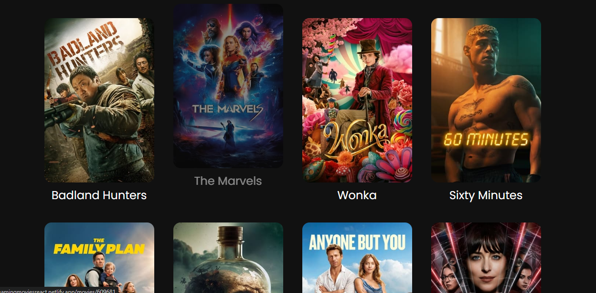
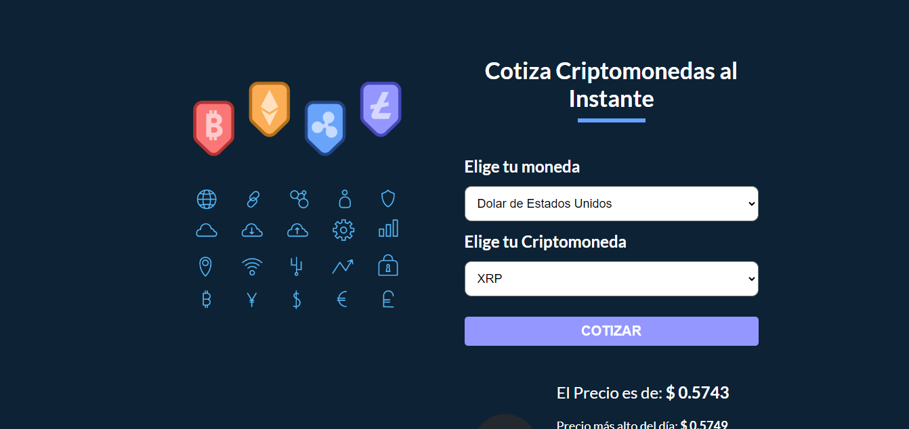

# Hi there, I'm Moises Alarcon 👋

### IT/OT Engineer · Industrial Automation · SCADA & Control Systems

  
  

---

## 👨‍💻 About Me

I'm an **IT/OT Engineer with a background in Mechatronics Engineering** and more than three years of hands-on experience in industrial environments.

My work focuses on connecting **industrial operations, automation systems, and modern IT technologies** through reliable, scalable, and secure solutions.

- 🏭 Specialized in **SCADA, ICS, industrial automation, and control systems**
- 🌐 Experienced with **industrial networks, VLAN segmentation, and redundant architectures**
- 🔐 Interested in **OT cybersecurity and secure IT/OT convergence**
- 💻 Develop applications using **C#, .NET, SQL Server, and React**
- 📊 Explore industrial data integration with **SQL Server and Power BI**
- 🤖 Passionate about **smart manufacturing, industrial digitalization, and embedded systems**

> My goal is to design and implement reliable industrial infrastructures that connect operational technology with modern information systems.

---

## ⚙️ Technical Skills

### 🏭 Industrial Automation & SCADA

### 🌐 Industrial Networking & Security

### 💻 Software Development & Data

---

## 🚀 Featured Projects

<table>
  <tr>
    <td width="50%" valign="top">

### 🔌 SCADA Network Architecture

Design of a secure and redundant SCADA network integrating IT and OT environments through network segmentation and industrial communication concepts.

**Technologies**

- Cisco Packet Tracer
- VLAN segmentation
- Redundant network topology
- Industrial protocols

[📄 View documentation](https://drive.google.com/drive/folders/1VXUMt1kgyA9bRzVHP9nyHruoZkFCZvrb?usp=drive_link)

    </td>
    <td width="50%" valign="top">

### 📊 Industrial Monitoring Dashboard

A monitoring interface inspired by SCADA systems, focused on industrial process visualization and real-time data presentation.

**Technologies**

- React
- REST APIs
- Data visualization

> Add the GitHub repository link here.

    </td>
  </tr>
</table>

---

## 🏭 Industrial & SCADA Projects

### Industrial SCADA Network — Cisco Packet Tracer

A project focused on designing a **secure and redundant SCADA network architecture**.

**Main components**

- Control center network
- Industrial plant network
- VLAN-based segmentation
- Redundant communication paths
- Industrial networking concepts
- Separation of IT and OT environments

---

## 💻 Software & Embedded Projects

<table>
  <tr>
    <td width="50%" valign="top">

### 🎬 Movies React App

A movie application built with React.

[🌐 Live demo](https://streamingmoviesreact.netlify.app/) · [💻 Source code](https://github.com/abrahanalarcon/movies-react)

    </td>
    <td width="50%" valign="top">

### 💰 Cryptocurrencies React App

A cryptocurrency dashboard built with React, Styled Components, and the CryptoCompare API.

[🌐 Live demo](https://excryptocurrenciesreact.netlify.app/) · [💻 Source code](https://github.com/abrahanalarcon/criptos-react)

    </td>
  </tr>
  <tr>
    <td width="50%" valign="top">

### 🎮 Pong Game

An embedded-systems project developed with STM32CubeIDE, featuring a joystick, speaker, and LED matrix.

[📁 View project files](https://drive.google.com/file/d/1N2rT0_z09XyZsWMHNTz0_fk9kC2ZHI31/view?usp=sharing)

    </td>
    <td width="50%" valign="top">

### 🤖 Obstacle-Avoiding Robot

A mechatronics project focused on autonomous movement and obstacle avoidance.

[📁 View project files](https://drive.google.com/drive/folders/1KsrOZYiIOv19Ww4PmzuIddCSfq8zqjBk?usp=drive_link)

    </td>
  </tr>
</table>

---

## 💼 Professional Experience

  
<b>🏭 IT/OT Engineer — Industrial Systems & Technology</b>

- Management and support of industrial IT infrastructure
- Integration between IT systems and operational technology
- Development of internal applications using C#, .NET, and SQL
- Support and troubleshooting for industrial automation and SCADA systems

  
<b>💻 Software Developer — Enterprise Systems</b>

- Development of applications using C#, .NET, and SQL Server
- Implementation of internal management systems
- Support for enterprise software environments

---

## 📸 Industrial Experience

  

  <i>Hands-on experience in industrial instrumentation, control systems, and power generation.</i>

---

## 📊 GitHub Statistics

  
  

---

## 🤝 Let's Connect

  

  <b>Let's build reliable, secure, and innovative industrial solutions. 🏭⚡</b>

